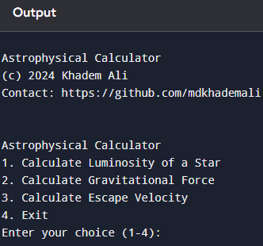

## Astrophysical Calculator

Astrophysical Calculator is a Python-based tool designed for astrophysics enthusiasts and students. It performs basic astrophysical calculations such as:
1. **Luminosity of a Star**
2. **Gravitational Force**
3. **Escape Velocity**

## Features

- **Luminosity Calculation**: Uses Stefan-Boltzmann law.
- **Gravitational Force Calculation**: Based on Newton's law of gravitation.
- **Escape Velocity Calculation**: Computes the velocity needed to escape a celestial body's gravity.

## Screenshot

© mdkhademali
